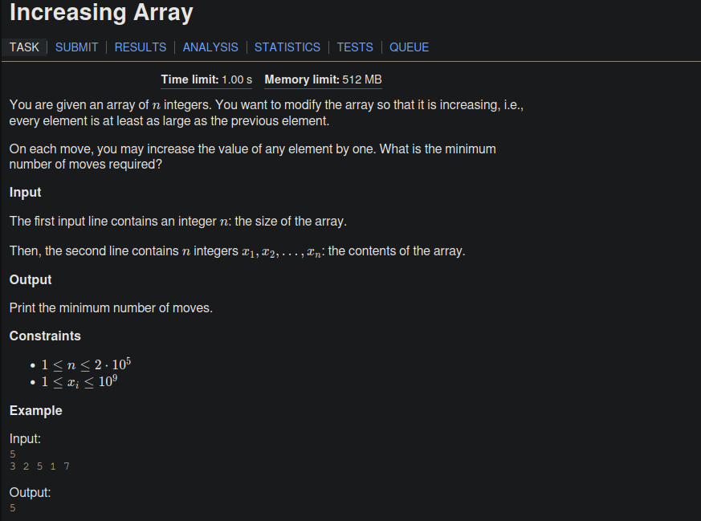

## Problem Statement

#### In short
Given: Unsorted array. Goal: Make it sorted. How: In one move increase value of any array by 1. Ans: How many operations requeired to make the array sorted in increasing order.
##### Keep in mind
- 1 <= x <= 10^6 (Use long long).
## Code
```cpp
#include <bits/stdc++.h>
using namespace std;

mt19937 rnd(chrono::steady_clock::now().time_since_epoch().count());
#define fastread() (ios_base::sync_with_stdio(false), cin.tie(NULL));
typedef long long ll;
#define endl "\n"

int main() {
  fastread();
  ll n; cin>>n;
  vector<ll>v(n); 
  for(auto &it: v){
    cin>> it;
  }
  ll cnt =0;
  for(ll i =1; i<n; i++){
    if(v[i-1]>v[i]) {
      cnt += v[i-1] - v[i];
      v[i] = v[i-1];
    }
  }
  cout<< cnt << endl;
  return 0;
}

```
#### Explanation
- If element in i-1 index greater than i then make them equal and keep track of their difference and add that to final answer.
---
