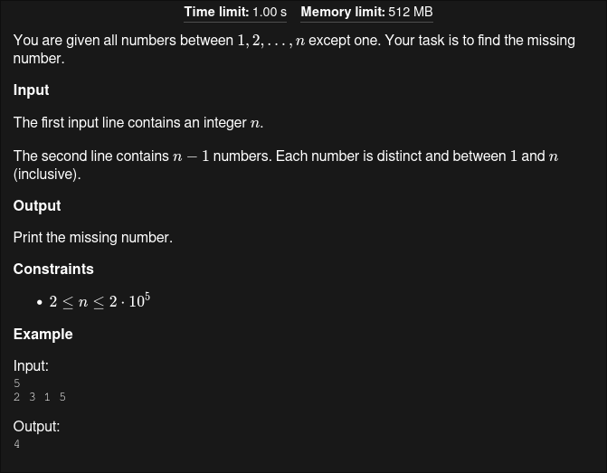

## Problem Statement

#### In short
- Find a missing number from the numbers from 1 to n.
#### Constraints
- 2 <= n <= 2*10^5
- When performing operations like `n*n`, ensure the use of `long long` to avoid overflow since the result can go up to `10^10`.
## Code
```cpp
#include <bits/stdc++.h>
using namespace std;
mt19937 rnd(chrono::steady_clock::now().time_since_epoch().count());
#define  fastread() (ios_base:: sync_with_stdio(false), cin.tie(NULL));
typedef long long ll;
#define endl "\n"

int main(){
  fastread();
  ll n; cin>>n;
  ll sum=0, total = (n*(n+1))/2;
  for(auto i =1; i<n; i++){
  	ll x; cin>> x ;
  	sum += x;
  }	 
  cout<< total - sum << endl;
return 0;
}
```
#### Explanation
    1. Calculate the Total Sum:
        Use the formula for the sum of the first nn natural numbers:
        Sum=n×(n+1)2
        Sum=2n×(n+1)​
        This gives the total sum of numbers from 11 to nn.

    2. Accumulate the Input Sum:
        Iterate through n−1n−1 numbers (the given sequence) and calculate their sum.

    3. Find the Missing Number:
        Subtract the accumulated input sum from the total sum:
        Missing Number=Total Sum−Input Sum
        Missing Number=Total Sum−Input Sum
        Output the result.
#### Time Complexity
- The algorithm runs in O(n).
---
