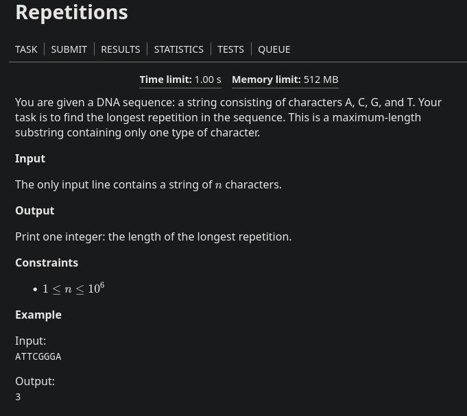

## Problem Statement

#### In short
Cout the number of longest repeating single character, example, AATTCGGGA will cout 3 cause G is repeating 3 times.
##### Keep in mind
- 1<= n <= 10^6
## Code
```cpp
#include <bits/stdc++.h>
using namespace std;
mt19937 rnd(chrono::steady_clock::now().time_since_epoch().count());
#define  fastread() (ios_base:: sync_with_stdio(false), cin.tie(NULL));
typedef long long ll;
#define endl "\n"

int main(){
  fastread();
  string s; cin>>s;
  int ans = 1, cnt =1;
  for(int i = 1 ; i < s.length() ; i++){
  	cnt = (s[i]==s[i-1]) ? cnt + 1 : 1;
  	ans = max(ans, cnt);
  }
  cout<< ans << endl;
return 0;
}
```
#### Explanation
- Initialize ans and cnt variable with 1 because the min value of n is 1 given in contraints so the min answer would be 1.
- Compare if the consecutive characters are same then increase the count by 1 if not again make it's value to 1.
- Compare if the cnt is greater than ans then it should be our new answer.


