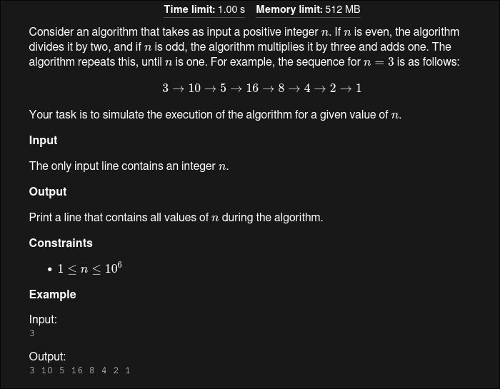

## Problem Statement

#### In short
Take n(+ve int) as an input, if n is even make n = n/2 and if n is odd n = (n*3)+1; Repeat the process unitil n becomes 1. Output all the values of n form n->1
##### Keep in mind
- 1 <= n <= 10^6 (Use long long).
## Code
```cpp
#include <bits/stdc++.h>
using namespace std;
mt19937 rnd(chrono::steady_clock::now().time_since_epoch().count());
#define  fastread() (ios_base:: sync_with_stdio(false), cin.tie(NULL));
typedef long long ll;
#define endl "\n"

int main(){
  fastread();
  ll n;
  cin>>n;
  cout<< n << " ";
  while(n>1){
  	cout<< ((n&1)? (n=(n*3)+1) : (n/=2)) << " ";
  }
return 0;
}
```
#### Explanation
- `while(n>1)` : Perform the operation until n is greater than 1.
- `(n&1)` : Bitwise `&` operator used to check if n is odd. In this case if n is odd, this returns `true`.
- `? (n = (n * 3) + 1) : (n /= 2)`: The ternary operator checks if n is odd or even. If n is odd, it performs `n = (n * 3) + 1`; otherwise, it performs `n = n / 2`.
##### Why?
- Why use `(n>1)` in while instead of `(n>=1)`?
    - Using (n > 1) ensures that the loop terminates when n reaches 1. If (n >= 1) were used, the loop would continue indefinitely after n becomes 1 due to the n = 4 step. 
